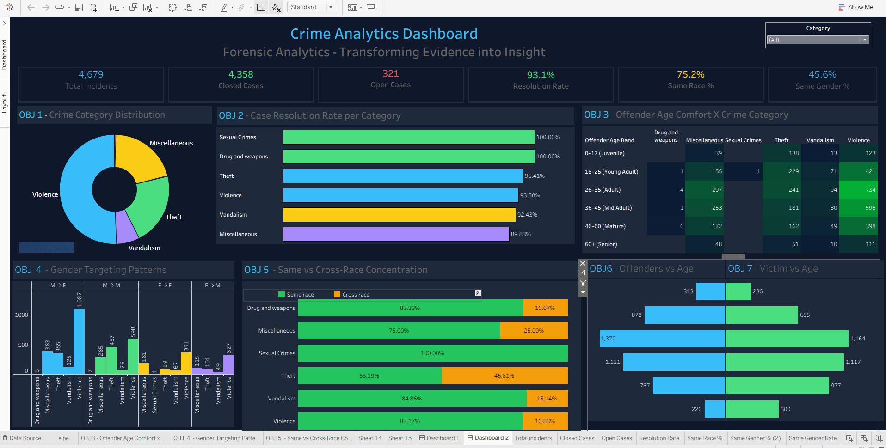

# Crime Analytics Dashboard

An interactive crime analytics dashboard built using Tableau and deployed as a static website using GitHub Pages.

Live Demo:  
https://upadhyayayush913-tech.github.io/Crime-Database-Dashboard/

---

## Overview

This project presents crime data insights through an interactive dashboard, enabling users to explore patterns across categories, demographics, and resolution metrics.

The dashboard provides insights into:
- Crime trends across categories
- Case resolution efficiency
- Offender age distribution vs crime type
- Demographic relationships (race and gender)

---

## Key Features

### KPI Metrics
- Total Incidents
- Closed Cases
- Open Cases
- Resolution Rate
- Same Race Rate
- Same Gender Rate

### Visualizations
- Crime category distribution
- Resolution rate by category
- Heatmap of offender age vs crime type

### Interactivity
- Category-based filtering
- Cross-visual interaction

---

## Tech Stack

- Data Visualization: Tableau Public  
- Frontend: HTML, CSS  
- Hosting: GitHub Pages  

---

## Deployment Architecture

Tableau Dashboard → Tableau Public → Embedded via HTML → GitHub Pages

## Dashboard Preview

  

---

## Project Structure
Crime-Database-Dashboard/
│── index.html # Main webpage embedding Tableau dashboard
│── README.md # Project documentation
│── .gitignore # Ignore unnecessary files (twbx, twbr, etc.)
│── Screenshot.png # Dashboard preview image

